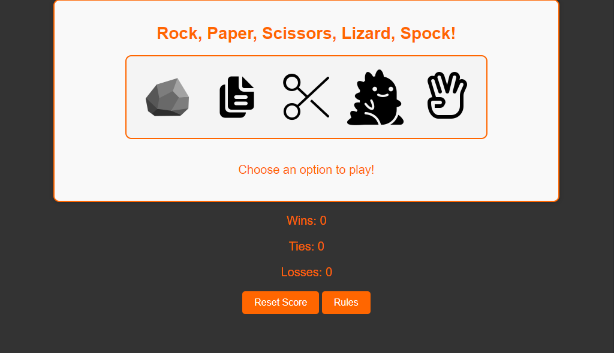
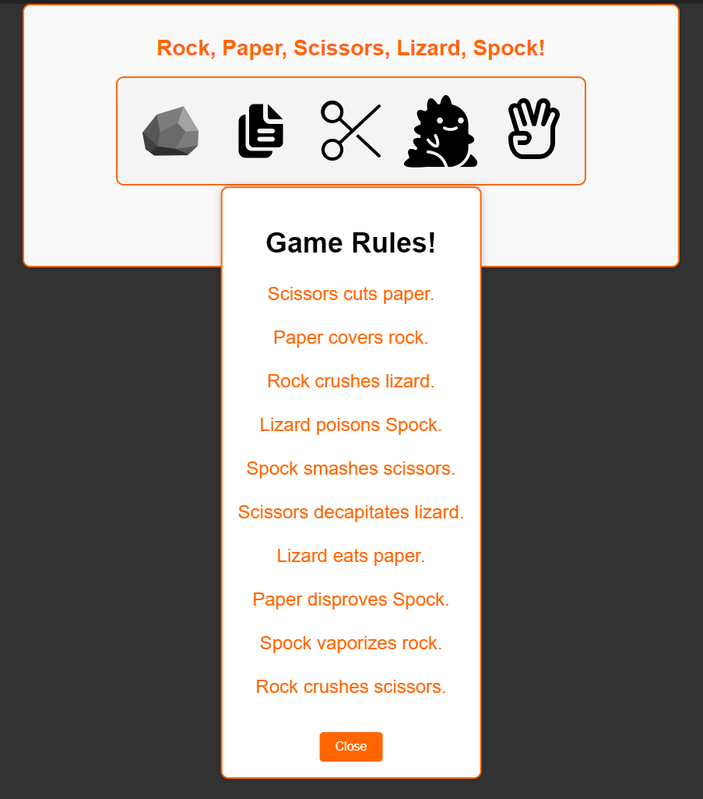
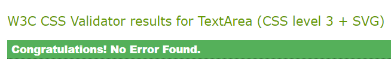
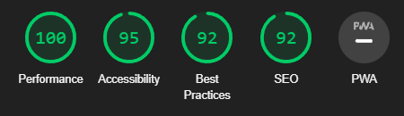

# Rock, Paper, Scissors, Lizard, Spock!

## Overview

This is a simple Rock Paper Scissors Lizard Spock website. It's based on the classic Rock, Paper, Scissors game but with the addition of two more options: Lizard and Spock. The is single player against a computer opponent. It tracks the player's wins, ties, and losses, while also allowing for resetting the score.

## Features 

### Existing Features

- **User-Friendly Interface**: The game offers an intuitive and visually appealing user interface.
- **Instant Results**: Get immediate feedback on the game outcome and see who wins.
- **Score Tracking**: Keep track of your wins, ties, and losses.
- **Reset Score**: Reset your score with a single click and start a new game.
- **Rules**: Quickly get informed about the rules of the game.

### Features Left to Implement

- **Multiplayer Mode**: Enable users to play against friends or family online.
- **Sound Effects**: Add sound effects to make the game more engaging.

## How to Play

1. Choose your move between Rock, Paper, Scissors, Lizard, or Spock.
2. The computer will randomly select its own move.
3. The game will determine the winner according to the rules.
4. View the results and see your score.
5. Play as many rounds as you like and aim to outsmart the computer.

## Technologies Used

- HTML
- CSS
- JavaScript

## Testing

The website has been validated using W3C Markup Validator, W3C CSS Validator and JSHint.

* [W3C Markup Validtor](https://validator.w3.org/)
* [W3C CSS Validator](https://jigsaw.w3.org/css-validator/)
* [JSHint](https://jshint.com)

### Results

-HTML
    -No errors were returned when passing through the W3C Validator.
-CSS
    -No errors were found when passing through the offical W3C Validator
-JavaScript
    -No errors were found when passing through JSHint

-Lighthouse
    -The website recived the scores:
        100 on Performance
        95 on Accessibility
        92 on Best Practices
        92 on SEO

## Deployment

You can play the game by visiting [here](https://pontaaaa.github.io/Rock-Paper-Scissors/).

- The site was deployed to GitHub pages. The steps to deploy are as follows: 
  - In the GitHub repository, navigate to the Settings tab 
  - From the source section drop-down menu, select the Master Branch
  - Once the master branch has been selected, the page will be automatically refreshed with a detailed ribbon display to indicate the successful deployment. 

The live link can be found here - https://github.com/Pontaaaa/Rock-Paper-Scissors

## Credits

* Understanding how to create and style Overlay was learned through [How TO - Overlay](https://www.w3schools.com/howto/howto_css_overlay.asp#gsc.tab=0)
* Template for the README was provided by [Code Institute (template)](https://github.com/Code-Institute-Solutions/readme-love-maths/blob/master/README.md?plain=1)
* Understanding the rules of Rock, Paper, Scissors, Lizard, Spock was learned through [wikiHow - How to Play Rock Paper Scissors Lizard Spock](https://www.wikihow.com/Play-Rock-Paper-Scissors-Lizard-Spock#:~:text=Scissors%20cuts%20paper%2C%20paper%20covers,same%20signal%2C%20it%27s%20a%20tie.)

## Media

[icons8](https://icons8.com/icons) free icons. Used for game Choices and Favicon.